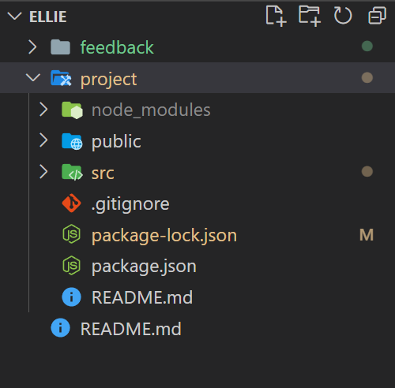

# Feedback

Hey Charlie here, feel free to message me on Slack if you want any clarification on the points below. I will give you both positive and constructive feedback on your project.

---

## Requirements

- Should be built in React - DONE
- Use the Punk API (after using the data file first)
  - DATA FILE - DONE
  - API - DONE
- Test where possible (RTL)
  - Covered later on course so no time to implement, when you have time give it a go.
- Repository on GitHub - DONE

### Start

> "All the wireframe content in black is the first part of the challenge - that is, the sidenav, the main section containing the beers and beer cards for each piece of data. The component tree is below to help you get started."

Below I have the component tree from the brief and your component tree.


You are missing the `<Navbar/>` , `<FilterList/>`, `<Main/>` and `<CardList/>` components.

The reason why we have them in the brief is to force you to think in terms of components, we also want to make you pass data with props.

It is important to think about how you break a project into small reusable components, this is how you build large applications. When you have components you need to know how you can get props to multiple components.

At the moment you are only ever passing props one level

e.g from the `<App/>` to `<Search/>`

If you had the missing components you would of had to pass props through multiple components.

e.g. from `<App/>` to `<Main/>` to `<CardList/>` to `<Card/>`

It may seem like overkill and might be for an application this size but it is something you need to be confident with as sometimes you will have to pass props to a component to pass it to another component to use.

When you have some time create the components above, it will be good practice creating components and also getting props to the components that need them.

### Extension 1

> Once you've got the design and layout sorted to render the elements, it's time to add some search functionality. Make it so you can search the beers by their name, and the page content should update as you type each letter in the box.

The aim of this extension is to get you using functions as props. You have smashed it, `searchChanged()` in your app is being passed to your `<Search/>` component to use. I would suggest a slight refactor of the component as you are doing the work twice. You set it to state in the component and then set it to state in the app as well.

```jsx
// Search.jsx
const Search = props => {
  const { onChange, searchTerm } = props;
  // THE COMPONENT GETS GIVEN A FUNCTION AND THE SEARCH TERM
  // THE APP CAN STORE THE VALUE
  return (
    <div>
      <input type="text" placeholder="Search" value={searchTerm} onChange={onChange}></input>
    </div>
  );
};
```

```jsx
// App.jsx

// THIS CAN SET THE EVENT TO THE APP STATE
// WHAT YOU HAD IN THE SEARCH PREVIOUSLY
const searchChanged = event => {
  setSearchTerm(event.target.value);
};

// IN THE RETURN -> GIVE IT THE PROPS IT NOW NEEDS
<Search onChange={searchChanged} searchTerm={searchTerm} />;
```

Just a small tweak to reduce duplication and unnecessary state.

Once it is set to state in the app you use your `executeFilter()` function to see if the searchTerm is in the name.

I think you could use [.includes()](https://developer.mozilla.org/en-US/docs/Web/JavaScript/Reference/Global_Objects/String/includes) as it is clearer.

```jsx
// App.jsx
// LINES 51 - 55
if (beer.name.toLowerCase().indexOf(searchTerm.toLowerCase()) != -1) {
  return true;
} else {
  return false;
}

// COULD BE

if (beer.name.toLowerCase().includes(searchTerm.toLowerCase())) {
  return true;
} else {
  return false;
}
```

There is an alternative way of doing the search, this is with query params. On the API docs it has a `beer_name` param which you can append to the url with a value. The value is what you want to search. Why not try and implement the search with this?

```jsx
// App.jsx
const getBeers = async () => {
  let url = "https://api.punkapi.com/v2/beers";
  // IF I HAVE A SEARCH TERM HOW CAN I APPEND THE QUERY PARAM TO THE URL?
  // beer_name= ??

  const response = await fetch(url);
  const data = await response.json();
  setSearchedBeers(data);
  setAllBeers(data);
};
```

### Extension 2

> Finally attempt to make it so you can filter the content on three conditions:
>
> - High Alcohol (ABV value greater than 6%)
> - Classic Range (Was first brewed before 2010)
> - High Acidity (pH lower than 4)

You have taken the alternative approach to adding the filters and with a little bit of tweaking it does work for the ph and abv. You were very close to implementing it.

You capture the value of the option that gets selected in your `<Filter/>` component this gets stored in the App state. You trigger your `executeFilter()` function, you are looking for a match in the switch statement inside this function. The small change I had to make is that you are not matching the values you are storing in state.

You are trying to match `case "ABV":` and `case "acidic":` the values you are going to be storing in state are below.

```jsx
// Filter.jsx
const filters = ["all", "ABV > 6%", "acidic(PH < 4"];
const filterOptionsJSX = filters.map(filter => {
  // YOU SET THE VALUE TO EACH ITEM FROM THE ARRAY
  return <option value={filter}>{filter}</option>;
});
```

You just need to get your cases to match the value / the item from the array.

### Extension 3

> Style the website however you see fit! Go wild!

You have some basic styles that work for the 25 beers from the API.

I can see that you have prioritized the functionality which makes sense, when you have time come back and style it :).

---

## The App

### Positive

- It looks good on desktop.
- You have all of the functionality that was requested.
- It is dynamic and responding to the user interacting with it.

### Constructive

- Currently you need to re-organize the project.
  - You will want to move the contents of the `project` folder out of that folder and delete it.

Currently it looks like this.



It should be.


- This will make hosting the project easier, which you should be able to do.
- Some of the cards text is quite large, do you think you could only display the first sentence?
  - The description will be a string, what methods can you use on a string to shorten it?
- Update the readme.md with some Markdown & Remove the autogenerated code after the brief. [Markdown in 10mins](https://www.markdowntutorial.com/)

---

## The Code

### Positive

- You have multiple functions being passed across your application to the components that need them.

- With a little tweak you are able to store the value and apply the filters using state & funcs as props.

- You have connected it to an API!!!

- You are demonstrating that you have an understanding of props, useState, useEffect and funcs as props.

- Awesome good going! I can't wait to see what you build next.

### Constructive

- I am not sure how confident I feel about you being able to create components.

  - Try making the component tree from the brief and practice passing props.

- You have the error below in the console. You will know how to fix it.

```
react-jsx-dev-runtime.development.js:97 Warning: Each child in a list should have a unique "key" prop.

Check the render method of `Filter`. See https://reactjs.org/link/warning-keys for more information.
    at option
    at Filter (http://localhost:3000/static/js/bundle.js:363:5)
    at div
    at div
    at App (http://localhost:3000/static/js/bundle.js:39:92)
```

- You can implement some of the filters using query params read the docs and see if you can implement them when you have time.

  - `abv_gt=??`, `brewed_before=??`

- You have solved some of the problems with a good and reasonable solutions, make sure you understand:
  - **How** the code works.
  - **What** it is doing.
  - **Why** you have written it that way.

---
